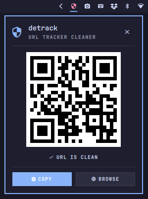

# 🛡️ DeTrack

> **URL Tracker Cleaner & Instant QR Code Sharer for Omarchy.**

[](https://opensource.org/licenses/MIT)
[](https://omarchyplugins.com)
[]()

<p align="center">
  
</p>

**DeTrack** automatically intercepts URLs in your clipboard, strips all tracking parameters (such as `utm_*`, `fbclid`, `gclid`, `matt_*`, Google/Facebook redirect wrappers, etc.), and instantly renders a pixel-perfect, scannable QR Code with 1-click **COPY** and **BROWSE** actions.

---

## ✨ Features

- 🧹 **Pure JavaScript Sanitization Engine (`Engine.js`)**:
  - Global tracking parameters (`utm_*`, `gclid`, `fbclid`, `_ga`, `mc_eid`, `mkt_tok`, `vgo_ee`, `hsa_*`, etc.).
  - E-commerce & Shopping filters (`matt_*`, `cq_*`, `gad_*`, `pdp_filters`, `from=gshop`, Amazon canonical `/dp/ASIN`).
  - Social media trackers (YouTube `si`/`feature`, Twitter/X `s`/`t`, TikTok, Instagram, Spotify, Twitch, Steam, Substack).
  - YouTube Shorts normalization (`/shorts/ID` -> canonical `/watch?v=ID`).
  - Unwraps Google (`google.com/url?q=`), Facebook (`l.facebook.com/l.php?u=`), and Reddit redirects.
- 🔍 **Interactive Tracker Breakdown & Shortlink Resolution**:
  - Click on the tracker badge to expand interactive tags showing each parameter stripped.
  - Detects shortener links (`bit.ly`, `t.co`, `tinyurl`) and offers 1-click on-demand unshortening.
- 📱 **Instant Native QR Code (`QRCode.js`)**:
  - Full 40-version Reed-Solomon support.
  - Native integer-module grid rendering for crisp, pixel-perfect camera scanning without blurry rasterization.
- ⚡ **Zero-Latency Clipboard Synchronization**:
  - Synchronously syncs with Omarchy's clipboard state (`~/.local/state/omarchy/clipboard-history.json`) and `wl-paste`.
- 🎨 **Native Omarchy Theme Integration**:
  - Uses `PanelHero`, `PanelSeparator`, `PanelKeyCatcher`, and `Style.cornerRadius` to adapt automatically to any Omarchy theme and Hyprland window rounding.
- ⌨️ **Keyboard Navigation**:
  - `C` / `Ctrl+C`: Copy cleaned URL to clipboard.
  - `B` / `Enter` / `Space`: Open cleaned URL in default web browser.
  - `Tab` / `Shift+Tab`: Switch between bar panels.
  - `Esc`: Close popup.
- 💻 **Standalone CLI Tool (`detrack`)**:
  - Clean URLs directly in your terminal or scripts via `detrack --clipboard --qr`, with support for `--unshorten` and `--preserve`.

---

## 📦 Installation

### Option 1: Automatic Script
Clone the repository and run the install script:
```bash
git clone https://github.com/jvlianodorneles/detrack.git
cd detrack
./install.sh
```

### Option 2: Manual Installation
Copy the repository into your Omarchy plugins directory:
```bash
mkdir -p ~/.config/omarchy/plugins/dorneles.detrack
cp -r * ~/.config/omarchy/plugins/dorneles.detrack/
omarchy-restart-shell
```

---

## ⚙️ Configuration

DeTrack supports customizable settings in your Omarchy bar configuration (`~/.config/omarchy/shell.json`):

| Setting | Type | Default | Description |
|---|---|---|---|
| `showTrackerBadge` | `boolean` | `false` | Displays the number of stripped trackers directly on the bar icon. |
| `iconStyle` | `enum` | `"shield"` | Bar icon style (`"shield"`: 󰒃, `"link"`: 󰌹, `"qrcode"`: 󰐳). |
| `autoCleanClipboard` | `boolean` | `false` | Silently clean URLs copied anywhere on your system in background. |
| `preserveParams` | `string[]` | `[]` | Whitelist of query parameters to never strip (e.g. `["ref", "tag"]`). |

---

## 🧪 Testing

Run the automated test suite covering 29 unit tests:
```bash
node tests/test_engine.js
```

---

## 📄 License

This project is licensed under the [MIT License](LICENSE).
